# SpatialRust

<p align="center">
  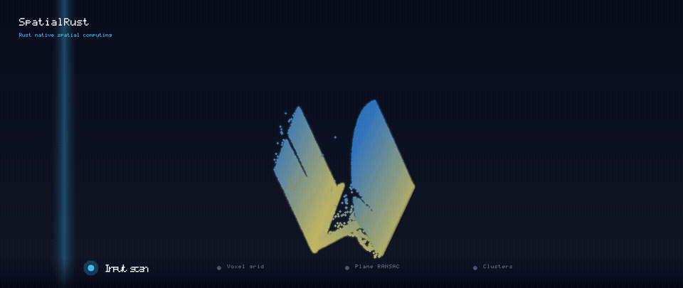
</p>

<p align="center">
  <strong>Rust-native spatial computing</strong><br>
  Point clouds · wgpu · COPC · RANSAC · ICP — native Rust, no C++ binding layer.
</p>

<p align="center">
  <a href="https://github.com/rsasaki0109/SpatialRust/actions/workflows/ci.yml"></a>
  <a href="https://rsasaki0109.github.io/SpatialRust/spatialrust/"></a>
  <a href="CHANGELOG.md"></a>
  <a href="#license"></a>
  
  
</p>

The hero GIF above is **real MVP pipeline output** (not a mockup): it uses the public PCL [`table_scene_lms400.pcd`](https://github.com/PointCloudLibrary/data/blob/master/tutorials/table_scene_lms400.pcd) sample, voxel-downsamples it, RANSAC peels off the dominant plane, and Euclidean clustering lights up objects in color — every frame rendered straight from a live pipeline run.

<p align="center">
  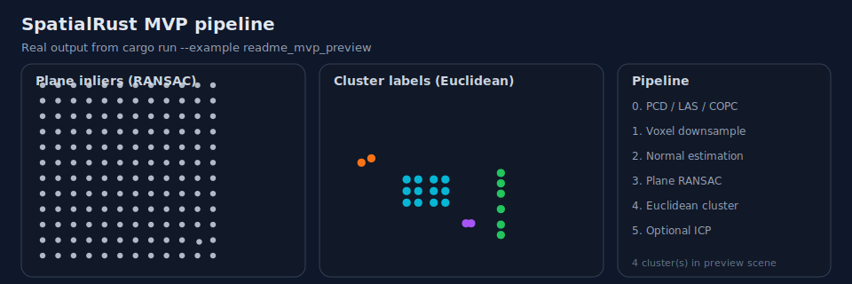
</p>

| ⚡ GPU-accelerated | 🗂️ COPC-native | 🦀 Pure Rust | 🧩 Composable |
| --- | --- | --- | --- |
| wgpu voxel filter, **~3.9× at 2M points**, automatic CPU fallback | **bounds + LOD** partial reads straight off disk — no full-tile load | no C++ / FFI binding layer to fight | one MVP crate: **IO → filter → segment → register** |

<p align="center">
  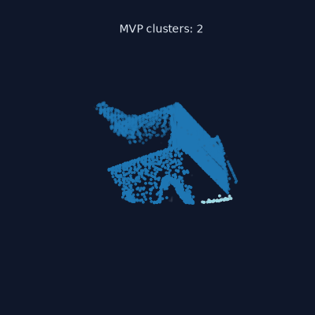
  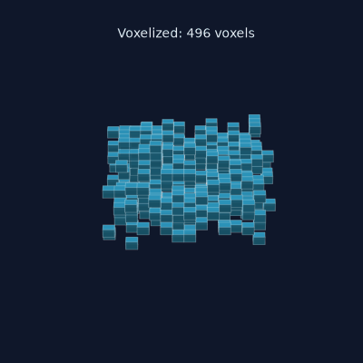
</p>
<p align="center"><sub>DBSCAN clustering and voxel occupancy grids, generated by <code>examples/make_gifs.py</code> through the Python bindings.</sub></p>

## Why SpatialRust?

| | Typical C++ stack (PCL / Open3D / OpenCV bindings) | SpatialRust |
| --- | --- | --- |
| Core language | C++ + FFI glue | **Native Rust** |
| Vision runtime | OpenCV linked into the app | **OpenCV optional for tests only** — production vision is Rust |
| GPU path | varies by wrapper | **wgpu voxel / normals** with CPU fallback |
| COPC | bolt-on scripts | **bounds + LOD queries** in library & CLI |
| Pipeline | glue code across image + cloud libs | **one MVP + north-star graph**: IO → filter → segment → register → scene |

**One command** from LAS/COPC to labeled clusters:

```bash
cargo run -p spatialrust --features mvp --bin spatialrust-mvp -- scan.las labeled.las
```

Partial COPC read + pipeline — stream only the region of interest straight off disk, no full-tile load:

```bash
cargo run -p spatialrust --features mvp --bin spatialrust-mvp -- \
  --bounds 0,0,-1,100,100,1 --resolution 0.5 scan.copc.laz roi.copc.laz
```

<p align="center">
  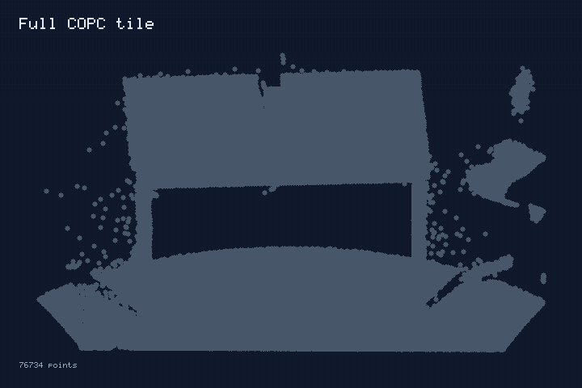
</p>

## Performance

The voxel downsampler runs on CPU or GPU (wgpu). `ExecutionPolicy::Auto` keeps small clouds on the CPU — where it's fastest — and switches to the GPU as point counts grow, so you get the best of both without tuning.

<p align="center">
  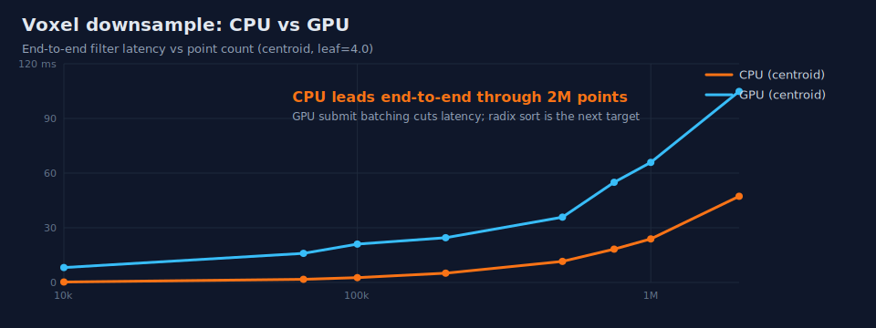
</p>

End-to-end centroid filter latency (leaf=4.0), measured via `cargo bench -p spatialrust-filtering`:

| Points | CPU | GPU | Winner |
| ---: | ---: | ---: | :--- |
| 100k | **~7 ms** | ~17 ms | CPU |
| 200k | **~24 ms** | ~26 ms | ~even |
| 500k | ~94 ms | **~51 ms** | GPU |
| 1M | ~155 ms | **~56 ms** | GPU (~2.8x) |
| 2M | ~389 ms | **~101 ms** | GPU (~3.9x) |

Reproduce: `cargo bench -p spatialrust-filtering --features filter-voxel-gpu --bench voxel_downsample`.

Normal estimation has an optional wgpu path (`GpuNormalEstimator`, `feature-normal-gpu`). In **radius mode** the neighbor search runs entirely on the GPU via a uniform grid (covariance + Jacobi eigensolver included), which is **up to ~50× faster** than the CPU KD-tree estimator:

| Points | CPU (KD-tree) | GPU grid | Speedup |
| ---: | ---: | ---: | :--- |
| 100k | ~220 ms | **~8.6 ms** | ~26× |
| 200k | ~442 ms | **~15 ms** | ~29× |
| 500k | ~1.47 s | **~29 ms** | ~50× |

(A k-nearest mode that keeps neighbor search on the CPU is also available but only ~1.1× — see [notes](notes/2026-06-15_gpu_normals_bench.md).) Reproduce: `cargo bench -p spatialrust-features --features feature-normal-gpu --bench normals`.

### vs PCL

A reproducible, apples-to-apples comparison against [PCL](https://pointclouds.org/) 1.15.1 — both libraries process the **same** public PCL `table_scene_lms400.pcd` scan (460,400 points) with matching parameters ([harness](bench/pcl_comparison/)). Values below are from a local Windows release run using MSYS2 g++ 16.1.0 and vcpkg; rerun the harness before publishing fresh cross-machine numbers.

```powershell
powershell -ExecutionPolicy Bypass -File bench\pcl_comparison\run.ps1
```

| Operation | SpatialRust | PCL | |
| --- | ---: | ---: | :--- |
| Radius Outlier Removal | **0.0899 s** | 1.8784 s | **20.89× faster** |
| Statistical Outlier Removal | **0.1664 s** | 2.0933 s | **12.58× faster** |
| Normal estimation (k=10) | **0.1461 s** | 1.9750 s | **13.52× faster** |
| Voxel downsample | **0.0104 s** | 0.0181 s | **1.74× faster** |

SpatialRust wins **4 of 4** against this PCL run; voxel downsampling now uses a specialized XYZ centroid path with compact `u32` voxel keys for the common min-origin case.

### vs Open3D

An Open3D comparison harness is available at [bench/open3d_comparison](bench/open3d_comparison/). It runs the same public PCL `table_scene_lms400.pcd` scan through SpatialRust and Open3D with matching voxel, normal, statistical outlier, and radius outlier parameters:

```bash
python bench/open3d_comparison/run.py
```

Indicative local result on one Windows machine (Open3D 0.19.0, Python 3.12, 460,400-point public PCL sample):

| Operation | SpatialRust | Open3D | |
| --- | ---: | ---: | :--- |
| Voxel downsample | **0.0132 s** | 0.0234 s | **1.77× faster** |
| Normal estimation | **0.1997 s** | 0.4946 s | **2.48× faster** |
| Statistical Outlier Removal | **0.2105 s** | 0.6565 s | **3.12× faster** |
| Radius Outlier Removal | **0.1049 s** | 66.4701 s | **633.65× faster** |

Record CPU, Open3D version, Python version, and thread settings before publishing new numbers.

### vs OpenCV

SpatialRust is **not** “OpenCV rewritten in Rust.” OpenCV remains a strong tuned image kernel library; we use it as a **correctness oracle** ([vision harness](bench/opencv_vision_comparison/), [RGB-D harness](bench/opencv_rgbd_comparison/)), not as a production dependency. SpatialRust instead focuses on an explicit, Rust-native spatial pipeline:

| | OpenCV-centered stack | SpatialRust |
| --- | --- | --- |
| Rust production deps | Often pulls OpenCV/C++ through FFI | **No OpenCV in the Rust runtime** — pure Rust crates; OpenCV only in optional Python comparison benches |
| 2D → 3D continuity | Image modules, then a separate point-cloud stack | **One repo**: filters/Feature2D/geometry → RGB-D → clouds → wgpu → sync/scene/export |
| Memory / devices | `cv::Mat` habits; copies are easy to hide | **Explicit, named host↔device transfers**; production APIs forbid silent copies |
| Safety | C++ ABI + wrappers | Public crates keep **`#![deny(unsafe_code)]`** outside audited FFI/GPU boundaries |
| Data model | Arrays + ad-hoc metadata | **Versioned `SpatialRecord`**, schema evolution, episodes, MCAP XYZ, ROS 2 CDR PointCloud2 |
| Reproducible ORB | Private learned BRIEF table | **Documented fixed-seed BRIEF** with interoperable Hamming distances |
| 3D / robotics surface | Not the primary product | **COPC bounds+LOD, MVP cloud pipeline, TSDF/USDA/Gaussian, ReleaseGate** |

#### CPU vision speed

Seeded, interleaved Python API timings on one Windows 11 host (OpenCV 4.10,
12 threads, OpenCL off; CPython 3.12; three warmups; VGA/1080p/4K use
20/8/3 samples). Each cell names the faster implementation and median-latency
ratio; these are machine-specific measurements, not universal guarantees.

| Workload | VGA | 1080p | 4K |
| --- | ---: | ---: | ---: |
| AI CHW preprocess, allocate | **SpatialRust 4.48×** | **SpatialRust 9.27×** | **SpatialRust 9.14×** |
| AI CHW preprocess, reuse vs OpenCV allocate | **SpatialRust 8.16×** | **SpatialRust 14.56×** | **SpatialRust 15.78×** |
| Bilinear resize, allocate | OpenCV 26.46× | OpenCV 64.02× | OpenCV 93.61× |
| Bilinear resize, reuse | OpenCV 27.36× | OpenCV 145.81× | OpenCV 113.87× |
| RGB to gray, allocate | OpenCV 11.97× | OpenCV 5.98× | OpenCV 12.98× |
| RGB to gray, reuse | OpenCV 6.01× | OpenCV 13.81× | OpenCV 2.09× |
| Gaussian blur 5×5 | OpenCV 139.02× | OpenCV 107.91× | OpenCV 167.28× |
| Sobel X 3×3 | OpenCV 14.38× | OpenCV 20.31× | OpenCV 23.30× |
| Morphology open 5×5 | OpenCV 805.78× | OpenCV 578.52× | OpenCV 774.40× |
| Canny | OpenCV 10.66× | OpenCV 12.54× | OpenCV 12.65× |
| Exact Euclidean distance transform, allocate | OpenCV 1.99× | OpenCV 1.85× | OpenCV 1.45× |
| Exact Euclidean distance transform, reuse | OpenCV 1.02× | OpenCV 1.06× | **SpatialRust 1.07×** |

The current CPU result is deliberately mixed: SpatialRust's fused typed CHW
path wins, while OpenCV's tuned general-purpose image kernels lead the present
SpatialRust scalar paths. Full medians, p95, dispersion, throughput, and raw
samples are produced by the [performance harness](bench/opencv_vision_comparison/performance.py);
the dated [Epic 111 receipt](notes/2026-07-15_epic111_opencv_comparison_v2.md)
records the exact environment and methodology.

The EDT fast path is exact on the canonical masks and reduced the native 4K
allocation benchmark from 451.63 ms to about 75 ms. With caller-owned output
and [`DistanceTransformWorkspace`](https://rsasaki0109.github.io/SpatialRust/spatialrust_vision/struct.DistanceTransformWorkspace.html),
the optimized native canonical Criterion median is about 35 ms. The Python API comparison
above gives SpatialRust a measured 1.07× 4K reuse lead, with maximum error zero;
VGA and 1080p remain narrow OpenCV wins. See the
[acceleration receipt](notes/2026-07-15_exact_edt_acceleration.md).

For AI detection post-processing, the seeded Python NMS harness uses identical
float32 boxes, scores, and thresholds and requires exact kept-index parity
before publishing timings:

| NMS candidates | OpenCV `dnn.NMSBoxes` | SpatialRust `nms` | Result |
| ---: | ---: | ---: | ---: |
| 100 | 0.298 ms | 0.033 ms | **SpatialRust 8.95×** |
| 1,000 | 8.720 ms | 2.286 ms | **SpatialRust 3.82×** |
| 8,400 (YOLO-style) | 407.086 ms | 126.562 ms | **SpatialRust 3.22×** |

These Windows-host medians include each Python API call and returned indices;
see the [NMS harness](bench/opencv_nms_comparison/) and dated
[receipt](notes/2026-07-15_nms_opencv_acceleration.md).

#### Vision accuracy

The same deterministic RGB inputs passed all VGA, 1080p, and 4K gates:

| Workload | OpenCV comparison result at VGA / 1080p / 4K |
| --- | --- |
| Bilinear resize | Exact pixels (max error 0) |
| RGB to gray | Max error 1/255; MAE 0.1333 / 0.1333 / 0.1329 |
| AI CHW preprocess | Max float error `5.96e-8` |
| Gaussian blur 5×5 | Max error 1/255; 96.28% exact pixels |
| Sobel X 3×3 | Exact values (max error 0) |
| Morphology open 5×5 | Exact pixels (max error 0) |
| Canny | Precision, recall, F1, and IoU all 1.0 |
| Exact Euclidean distance transform | Exact values on canonical profiles; separate irregular-mask max float error `9.54e-7` |

The broader correctness harness also checks filters, analysis, keypoints,
matching, and geometry with documented tolerances (exact pixels where we claim
parity; residual/translation/disparity tolerances where OpenCV's private
contracts differ). RGB-D unprojection tracks `cv.rgbd.depthTo3d` to ~`1e-5` m.

On dense `H×W×3` XYZ (320×240, OpenCL off, local Windows laptop), `spatialrust.depth_to_xyz` beats OpenCV `rgbd.depthTo3d` in the [RGB-D harness](bench/opencv_rgbd_comparison/) — about **1.4–1.5×** when both allocate, and about **2.1–2.2×** when both fill a reused buffer (`out=` / OpenCV `points3d`). Colored `rgbd_to_point_cloud` is about **20×** faster than OpenCV `depthTo3d` + NumPy mask/color gather. Re-run the harness before quoting numbers elsewhere; x86_64 builds use an audited AVX2 fill when available.

```powershell
python bench\opencv_vision_comparison\run.py
python bench\opencv_vision_comparison\performance.py
python bench\opencv_rgbd_comparison\run.py
python bench\opencv_nms_comparison\performance.py
```

### Registration methods

Four registration backends, compared on a synthetic box corner (7500 points, small misalignment):

| Method | Recovery error | Time | Notes |
| --- | ---: | ---: | --- |
| ICP (point-to-point) | 0.0196 m | ~147 ms | slow to converge on planar surfaces |
| **Point-to-plane ICP** | 0.0007 m | **~6.5 ms** | best speed/accuracy balance |
| GICP | **0.0006 m** | ~26 ms | most accurate; per-point covariance (optional GPU covariance ~1.7×, `register-gicp-gpu`) |
| NDT | 0.0008 m | ~8.7 ms | voxel distributions + Levenberg–Marquardt |

See [notes](notes/2026-06-15_registration_bench.md). Reproduce: `cargo bench -p spatialrust-registration --features register-icp,register-icp-point-to-plane,register-gicp,register-ndt --bench registration`.

## Status

MVP pipeline is implemented end-to-end: PCD/PLY/LAS/COPC IO, voxel downsampling (CPU + optional wgpu), normals, RANSAC plane segmentation, Euclidean clustering, region growing, and registration (ICP point-to-point/point-to-plane, GICP, NDT). See [docs/ARCHITECTURE.md](docs/ARCHITECTURE.md) for the master design.

Browse the published [algorithm catalog](https://rsasaki0109.github.io/SpatialRust/algorithms.html),
[Rust API reference](https://rsasaki0109.github.io/SpatialRust/spatialrust/index.html),
and [Vision 2 performance program](https://rsasaki0109.github.io/SpatialRust/vision2.html).

## Workspace crates

One dataflow, focused crates — each pipeline stage maps to the crate that implements it, all sitting on a small math/core/search foundation:

<p align="center">
  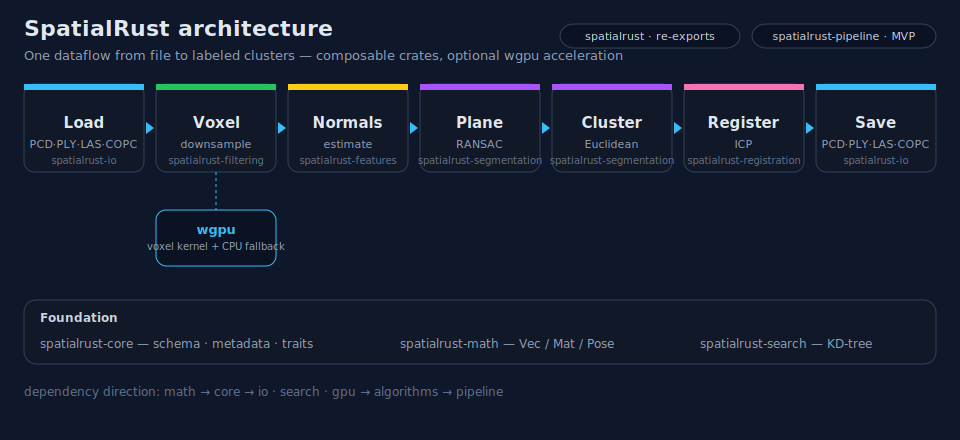
</p>

| Crate | Role |
| --- | --- |
| `spatialrust` | Meta crate / stable re-exports |
| `spatialrust-core` | Point schema, metadata, execution traits |
| `spatialrust-math` | Vec/Mat/Pose math primitives |
| `spatialrust-image` | Typed image buffers and zero-copy strided views |
| `spatialrust-image-io` | Bounded PNG/JPEG/PNM codecs; opt-in TIFF/OpenEXR |
| `spatialrust-tensor` | Runtime-independent dtype/shape/stride/device ownership and DLPack |
| `spatialrust-ai` | Explicit-copy inference contracts and opt-in ONNX Runtime providers |
| `spatialrust-camera` | Pinhole/Brown–Conrady camera models and RGB-D conversion |
| `spatialrust-vision` | CPU filters, Feature2D/ORB matching, resize/preprocess, warps, detection postprocess, masks, and dense spatial maps |
| `spatialrust-io` | Point cloud readers/writers (PCD, PLY, LAS, COPC) |
| `spatialrust-search` | KD-tree search, k-NN / radius graphs |
| `spatialrust-filtering` | Voxel / FPS downsample, outlier removal, crop, MLS |
| `spatialrust-features` | Normals (CPU + wgpu), ISS keypoints, FPFH, boundary, normal orientation |
| `spatialrust-segmentation` | RANSAC plane / sphere / cylinder, Euclidean, DBSCAN, region growing, ground |
| `spatialrust-registration` | ICP (point-to-point, point-to-plane), GICP, NDT, FPFH global |
| `spatialrust-transform` | Affine transforms, recenter / normalize, merge, AABB / OBB |
| `spatialrust-voxelize` | Voxel occupancy grids and LiDAR range images |
| `spatialrust-metrics` | Chamfer / Hausdorff cloud distances |
| `spatialrust-pipeline` | Composable MVP pipelines |
| `spatialrust-gpu` | wgpu runtime and voxel kernels |

## Python

The whole pipeline is callable from Python with NumPy interop — no C++ binding layer:

```python
import numpy as np
import spatialrust as sr

cloud = sr.PointCloud.from_xyz(points)            # (N, 3) float32 -> native cloud
result = sr.run_pipeline(cloud, leaf_size=0.1, cluster_tolerance=0.3)

print(result.plane_normal)                        # dominant plane normal (nx, ny, nz)
labels = result.labels()                          # (N,) int32 cluster ids
sr.write("labeled.las", result.output)            # LAS/PCD/PLY/COPC by extension
```

Aligned RGB-D images feed the same point-cloud pipeline without an OpenCV
runtime dependency:

```python
depth = np.ones((480, 640), dtype=np.float32)
rgb = np.zeros((480, 640, 3), dtype=np.uint8)
cloud = sr.rgbd_to_point_cloud(
    depth, rgb, fx=525.0, fy=525.0, cx=319.5, cy=239.5
)
result = sr.run_pipeline(cloud, leaf_size=0.03)
```

Rust users enable `camera-rgbd`; projection/unprojection supports optional
Brown–Conrady radial and tangential distortion. The reproducible numerical and
timing comparison against OpenCV is under `bench/opencv_rgbd_comparison/`.

The `vision-full` feature adds an AI-ready CPU image path with explicit data
ownership: nearest/bilinear/bicubic/area resize, letterbox and CHW normalization,
color conversion, remap/warps, IoU/NMS/Soft-NMS, connected components, contours,
RLE masks, and depth/confidence/flow/point maps. Dense maps bridge explicitly to
calibrated cameras and point clouds; no API performs a hidden device transfer.

```python
model_image, transform = sr.letterbox_image(rgb, 640, 640)
chw = sr.normalize_image_chw(model_image)                  # float32 (3,H,W)
keep = sr.nms(boxes_xyxy, scores, iou_threshold=0.5)
cloud = sr.point_map_to_point_cloud(points, confidence, 0.5)
```

The reproducible algorithm comparison is in
`bench/opencv_vision_comparison/`; the complete synthetic demo is
`crates/spatialrust-py/examples/vision_ai_pipeline.py`.

The same feature includes Harris, Shi–Tomasi, exact FAST-9/16, multi-scale ORB,
and checked Hamming/L2 descriptor matching. Python exposes `orb_features` and
NumPy matcher functions; OpenCV is used only by the numerical comparison suite.

An ONNX Runtime wheel is opt-in (`maturin develop --features onnxruntime`). Its
Python API uses named CPU I/O Binding by default; `copy=True` is the explicit
fallback for inputs that must be repacked:

```python
session = sr.OnnxRuntimeSession("model.onnx", deterministic=True)
input_tensor = sr.tensor_copy_from_numpy(chw)
outputs = session.run({"images": input_tensor})
scores = np.from_dlpack(outputs["scores"])
```

The Rust features are `ai`, `ai-onnxruntime`, and separate
`ai-onnxruntime-{cuda,tensorrt,directml}` provider gates. The optional ONNX
Runtime adapter currently has a feature-specific Rust 1.88 MSRV; it does not
raise the default workspace MSRV.

<p align="center">
  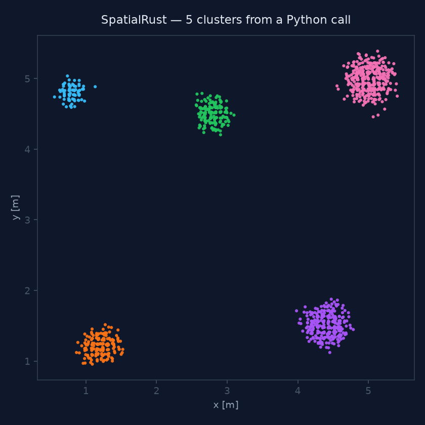
</p>

Registration is callable too — align two scans with ICP / point-to-plane / GICP / NDT:

```python
result = sr.register_gicp(source, target)   # also: register_icp / _point_to_plane / _ndt
T = result.transform()                       # 4x4 matrix mapping source -> target
```

<p align="center">
  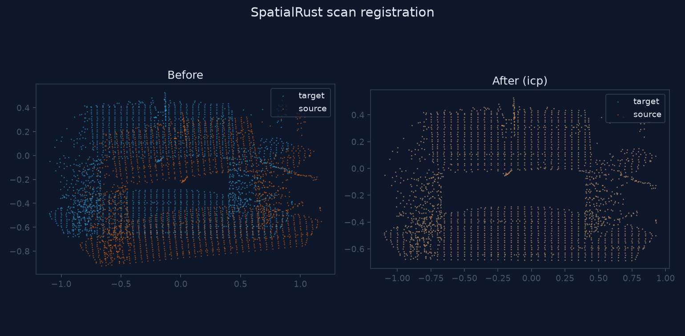
</p>

And it's a preprocessing front-end for learned models — turn a scan into model-ready tensors in a few calls (clean → unit-sphere normalize → FPS → voxel grid / range image / k-NN `edge_index`):

```python
sampled = sr.farthest_point_sampling(sr.normalize_unit_sphere(cloud), 2048)
occ, origin, vsize = sr.voxelize(sampled, voxel_size=0.06)   # (nz, ny, nx) occupancy
edge_index = sr.knn_graph(sampled, k=16)                     # (2, E) PyG-style graph
rimg = sr.range_image(sampled, width=256, height=64)         # (H, W) LiDAR depth
```

<p align="center">
  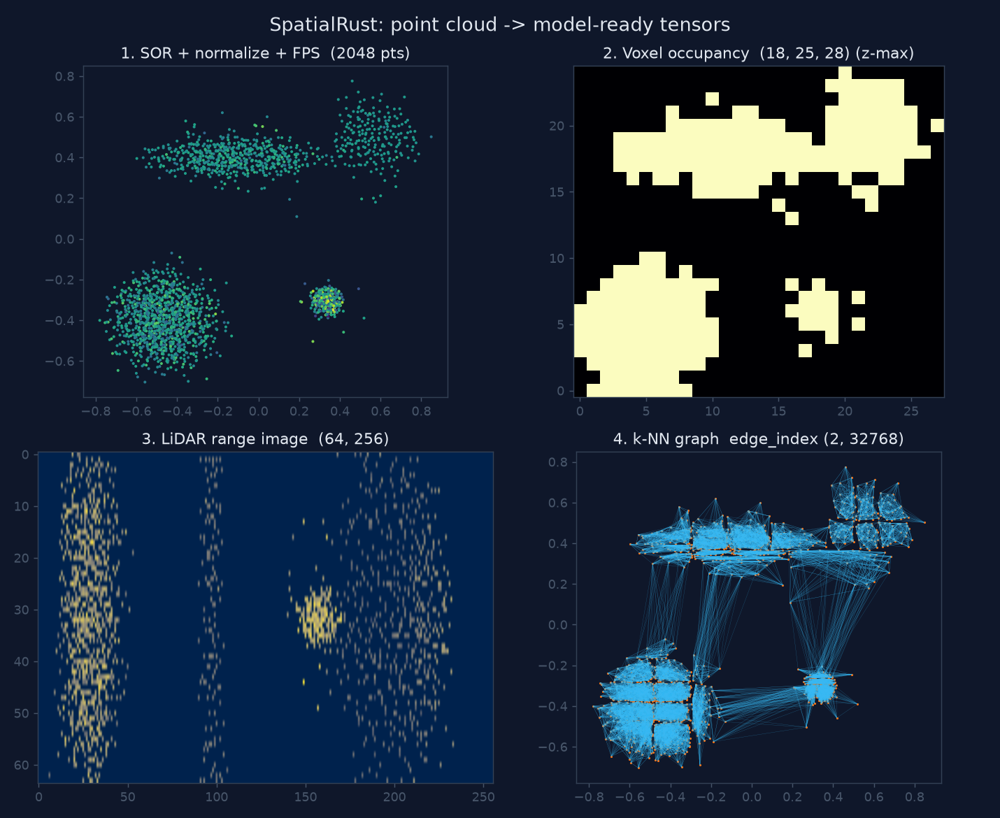
</p>
<p align="center"><sub>Generated by <code>examples/ml_preprocess.py</code> — see the Python <a href="crates/spatialrust-py/README.md">README</a>.</sub></p>

Build the extension with [maturin](https://www.maturin.rs/) and reproduce the Python previews from the same public sample:

```bash
pip install maturin numpy matplotlib
cd crates/spatialrust-py && maturin develop --release
mkdir -p ../../target/readme-data
curl -L --fail -o ../../target/readme-data/table_scene_lms400.pcd \
  https://raw.githubusercontent.com/PointCloudLibrary/data/master/tutorials/table_scene_lms400.pcd
PUBLIC=../../target/readme-data/table_scene_lms400.pcd
python examples/segment_room.py \
  --input "$PUBLIC" \
  --leaf-size 0.03 --plane-distance 0.025 \
  --cluster-tolerance 0.06 --min-cluster-size 8 \
  --png ../../docs/assets/python_segmentation.png
python examples/register_scans.py \
  --input "$PUBLIC" --leaf 0.05 \
  --png ../../docs/assets/python_registration.png
python examples/ml_preprocess.py \
  --input "$PUBLIC" \
  --png ../../docs/assets/ml_preprocess.png
```

Prebuilt `abi3` wheels (CPython 3.8+) are produced by CI and published to PyPI on tagged releases (`pip install spatialrust`). See [crates/spatialrust-py/README.md](crates/spatialrust-py/README.md) for the full Python API.

## Quick start

```bash
cargo test --workspace
cargo test -p spatialrust --features mvp
cargo doc --workspace --open
```

### CLI (MVP pipeline)

```bash
cargo run -p spatialrust --features mvp --bin spatialrust-mvp -- input.las output.las
cargo run -p spatialrust --features mvp --bin spatialrust-mvp -- \
  --leaf-size 0.2 --voxel-policy auto scan.copc.laz out.copc.laz
cargo run -p spatialrust --features mvp --bin spatialrust-mvp -- \
  --bounds 0,0,-1,100,100,1 scan.copc.laz roi.copc.laz
cargo run -p spatialrust --features mvp --bin spatialrust-mvp -- \
  --bounds 0,0,-1,100,100,1 --resolution 0.5 scan.copc.laz roi.copc.laz
cargo run -p spatialrust --features mvp --bin spatialrust-mvp -- \
  --resolution 0.5 scan.copc.laz coarse.copc.laz
cargo run -p spatialrust --features pipeline-mvp-gpu --bin spatialrust-mvp -- \
  --plane-policy auto --normal-policy auto --cluster-policy auto scan.las labeled.las
```

GPU stages (wgpu) share one policy surface: `--voxel-policy`, `--plane-policy`,
`--normal-policy`, `--cluster-policy` (or `MvpPipelineConfig::*_policy`). Auto
selects GPU from ~2k points for plane/cluster MVP paths and ~10k for normals.
When GPU normals run without an explicit `search_radius`, MVP derives one from
the voxel leaf (`normal_gpu_radius_scale`, default `2.0`) to use the fast grid path.
Full-cloud plane bench: ~11× speedup (`bench/ransac_plane/`). Cluster bench:
`bench/euclidean_cluster/` — grid union-find path matches CPU clusters; ~1.15× on MVP ~1.4k pts, ~1.0× on 460k full cloud (GPU KD-tree BFS path, Epic 69).

### Library

Load or save by file extension:

```rust
use spatialrust::{read_point_cloud_file, write_point_cloud_file};

let cloud = read_point_cloud_file("scan.las")?;
write_point_cloud_file("output.ply", &cloud)?;
```

COPC partial read:

```rust
use spatialrust::{read_copc_file_with_query, CopcBounds, CopcQuery};

let bounds = CopcBounds::from_ranges((0.0, 100.0), (0.0, 100.0), (-1.0, 1.0));
let cloud = read_copc_file_with_query("scan.copc.laz", &CopcQuery::bounds(bounds))?;
```

## MVP target pipeline

```
PCD/PLY/LAS/COPC -> voxel downsample -> normals -> plane RANSAC -> clustering -> ICP -> save
```

<p align="center">
  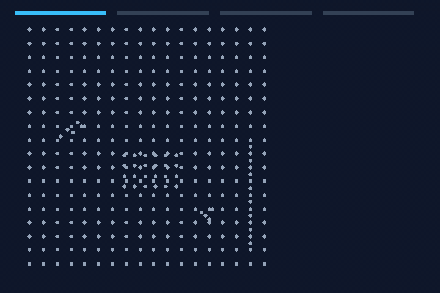
</p>

GPU voxel downsampling (wgpu) is available behind features. `ExecutionPolicy::Auto` keeps CPU for clouds below ~500k points (centroid mode). GPU plane, normal, and Euclidean clustering use the same policy flags (`--plane-policy`, `--normal-policy`, `--cluster-policy`).

```bash
cargo test -p spatialrust-gpu --features gpu-wgpu
cargo test -p spatialrust --features filter-voxel-gpu
cargo test -p spatialrust --features mvp,pipeline-mvp-gpu --test mvp_public_copc
cargo test -p spatialrust --features mvp mvp_copc_pipeline_roundtrip
cargo test -p spatialrust --features mvp mvp_copc_query_pipeline
python bench/public_copc/run.py
python bench/ransac_plane/run.py
python bench/euclidean_cluster/run.py
```

### Python (PyG demo)

After `maturin develop` in `crates/spatialrust-py/`:

```bash
python crates/spatialrust-py/examples/pyg_pointnet_demo.py
```

See also `crates/spatialrust-py/examples/make_gifs.py` and `examples/ml_preprocess.py`.

## README visuals

The main README pipeline visuals use the public PCL [`table_scene_lms400.pcd`](https://github.com/PointCloudLibrary/data/blob/master/tutorials/table_scene_lms400.pcd) sample, cached under `target/readme-data/` at generation time rather than committed to the repository. Regenerate them with:

```bash
cargo run -p spatialrust --features mvp --example readme_mvp_preview
```

Outputs: `readme_hero.gif` (header), `readme_mvp_preview.svg` (pipeline panel), `copc_query.gif` (COPC partial read), `benchmark_voxel.svg` (Performance chart), `architecture.svg` (crates diagram), `readme_mvp_pipeline.gif` (pipeline receipt: measured log + top-down result), and `social_preview.svg`.

Use `SPATIALRUST_README_CLOUD=/path/to/cloud.pcd` to render the same assets from another local public dataset.

The rotating `clusters_rotating.gif` and `voxelize_rotating.gif` are generated through the Python bindings from the same public sample: `python crates/spatialrust-py/examples/make_gifs.py --input target/readme-data/table_scene_lms400.pcd` (needs `maturin develop` + Matplotlib/Pillow).

## Social preview

Upload `docs/assets/social_preview.svg` (or export to PNG) as the GitHub repository social image under **Settings → General → Social preview**.

## License

Licensed under MIT OR Apache-2.0 at your option.
