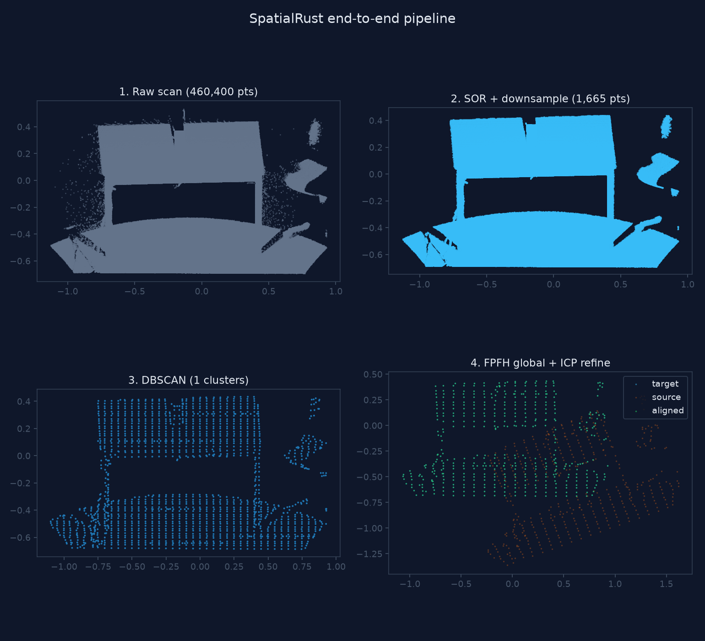

# spatialrust (Python)

Python bindings for [SpatialRust](https://github.com/rsasaki0109/SpatialRust) —
**PyTorch for Spatial Computing**. Native-Rust point cloud processing (IO, voxel
downsampling, RANSAC plane segmentation, Euclidean clustering) with NumPy interop
and no C++ binding layer.

## Install

Prebuilt `abi3` wheels (CPython 3.8+, Linux x86_64/aarch64) are built by the
[`Python wheels`](../../.github/workflows/python-wheels.yml) CI workflow and
published to PyPI on tagged releases:

```bash
pip install spatialrust
```

## Build from source

```bash
python -m venv .venv && source .venv/bin/activate
pip install maturin numpy
maturin develop --release        # builds the Rust extension into the venv
# or build a wheel:
maturin build --release --out dist
```

## Quickstart

```python
import numpy as np
import spatialrust as sr

# (N, 3) float32 XYZ -> native point cloud
pts = np.random.default_rng(0).uniform(0, 5, (10_000, 3)).astype(np.float32)
cloud = sr.PointCloud.from_xyz(pts)

# Voxel downsample (policy: "auto" | "cpu" | "cpu-single")
small = sr.voxel_downsample(cloud, leaf_size=0.1, policy="auto")

# Full MVP pipeline: downsample -> normals -> RANSAC plane -> clustering
result = sr.run_pipeline(cloud, leaf_size=0.1, cluster_tolerance=0.3)
print(result)                      # PipelineResult(points=..., clusters=..., ...)
print(result.plane_normal)         # (nx, ny, nz) of the dominant plane
labels = result.labels()           # (N,) int32 cluster ids
xyz = result.output.xyz()          # (N, 3) float32

# Read/write LAS/PCD/PLY/COPC by extension
sr.write("labeled.las", result.output)
reloaded = sr.read("labeled.las")
```

## API

| Symbol | Description |
| --- | --- |
| `PointCloud.from_xyz(arr)` | Build a cloud from an `(N, 3)` float32 array |
| `PointCloud.xyz()` | XYZ as an `(N, 3)` float32 array |
| `PointCloud.labels()` | Cluster labels as `(N,)` int32, or `None` |
| `PointCloud.field_names()` / `len(cloud)` | Schema fields / point count |
| `read(path)` / `write(path, cloud)` | IO by file extension |
| `voxel_downsample(cloud, leaf_size, policy="auto")` | Voxel-grid downsample |
| `crop_box(cloud, min, max, invert=False)` | Keep/drop points inside an AABB |
| `pass_through(cloud, field, min, max, invert=False)` | Keep/drop points by a field's value range |
| `mls_smooth(cloud, search_radius=0.1, polynomial_order=2, min_neighbors=6)` | Moving Least Squares surface smoothing |
| `statistical_outlier_removal(cloud, k_neighbors=16, std_mul=1.0)` | Drop points far from their k-NN (SOR) |
| `radius_outlier_removal(cloud, radius=0.5, min_neighbors=4)` | Drop points with too few neighbors in radius (ROR) |
| `run_pipeline(cloud, leaf_size=0.05, cluster_tolerance=None, min_cluster_size=None, plane_distance=None, policy="auto")` | Full MVP pipeline |
| `iss_keypoints(cloud, salient_radius=0.2, non_max_radius=0.15, ...)` | ISS keypoints (sparse salient sub-cloud) |
| `region_growing(cloud, k_neighbors=30, smoothness_deg=3.0, min_region_size=10)` | Estimate normals, then grow smooth regions |
| `dbscan(cloud, eps=0.5, min_points=10)` | Density-based clustering with noise labeling (`-1`) |
| `ransac_sphere(cloud, distance_threshold=0.02, ...)` | Fit the dominant sphere (center, radius, inliers/outliers) |
| `ransac_cylinder(cloud, distance_threshold=0.02, ...)` | Fit the dominant cylinder (axis, radius, inliers/outliers) |
| `register_icp(source, target, max_correspondence_distance=1.0, max_iterations=50)` | Point-to-point ICP |
| `register_point_to_plane(source, target, ..., k_neighbors=20)` | Point-to-plane ICP (normals estimated on target) |
| `register_gicp(source, target, ..., k_neighbors=20)` | Generalized ICP (plane-to-plane) |
| `register_ndt(source, target, resolution=1.0, max_iterations=35)` | NDT (Normal Distributions Transform) |
| `register_fpfh_ransac(source, target, feature_radius=0.25, ...)` | FPFH + RANSAC global registration (no initial guess; coarse) |

`register_*` return a `RegistrationResult` with `.transform()` (4x4 NumPy
matrix mapping source into the target frame), `.fitness`, `.iterations`, and
`.converged`.

## Example

```bash
python examples/segment_room.py --png room.png        # segmentation pipeline
python examples/register_scans.py --png reg.png        # two-scan registration
python examples/end_to_end.py --png demo.png           # full clean->cluster->register
```

`segment_room.py` synthesizes a scan-like room, runs the pipeline, and writes a
labeled cloud plus a top-down preview. `register_scans.py` makes a second scan by
applying a known misalignment, then aligns it back with each registration backend
(ICP, point-to-plane, GICP, NDT) and renders a before/after preview.

`end_to_end.py` runs the full workflow on one cloud — Statistical Outlier
Removal, voxel downsampling, DBSCAN clustering, then FPFH + RANSAC global
registration refined by ICP — and renders a four-panel figure of each stage. It
takes `--input scan.pcd` to run on a real scan (PCD/PLY/LAS/COPC), falling back
to a synthetic multi-object scene:


